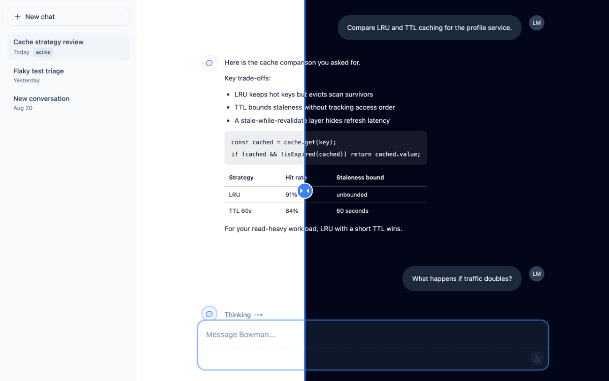
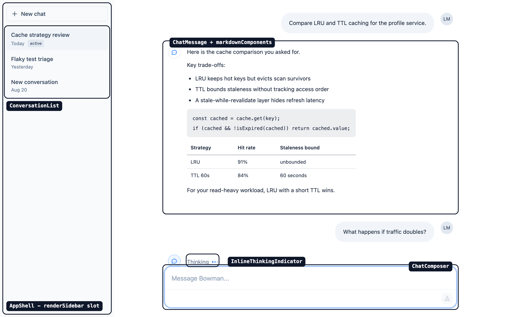
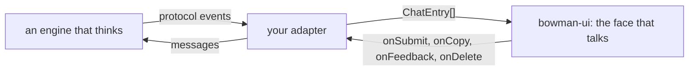
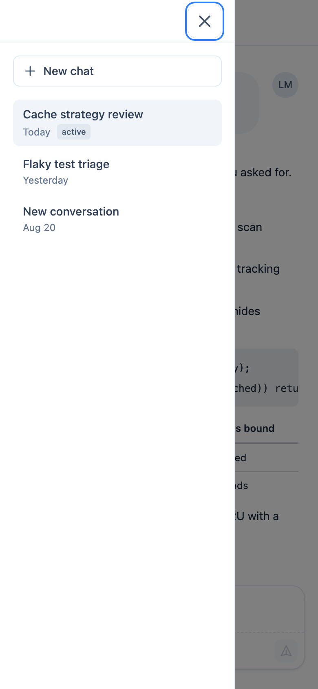

# bowman-ui

Presentational React components for AI chat interfaces.

`@re-cinq/bowman-ui` provides props-driven chat UI building blocks - message rendering, composer, conversation list, app shell - with no authentication, data-fetching, routing, or i18n dependencies. Consumers supply data and labels; the components render them.

The name follows the pairing the org chose: HAL Engine is the engine that thinks, Bowman is the face that talks to you.



_One surface, both themes, frozen mid-slide - the closest thing to a slider a README will allow._

## Install

```sh
npm install @re-cinq/bowman-ui
```

No version has been published yet; the install line above starts working with the first `v*` release.

## Requirements

- React and React DOM `^19.0.0` as peer dependencies. That range is what the components are tested against (React 19.2) - it is not a claim of React 18 support.
- Node.js `>=22` for development.

## Styles

Add two lines to your app's CSS entry:

```css
@import "@re-cinq/bowman-ui/styles.css";
@source "../node_modules/@re-cinq/bowman-ui/dist";
```

(Adjust the `@source` path so it points at the installed `dist` relative to your CSS file.)

Tailwind CSS v4 is required: the stylesheet ships only what Tailwind cannot generate from a class name - four animation keyframes (`bowman-fade-in`, `bowman-toast-fade-in`, `bowman-fade-dot`, `bowman-pulse-subtle`) with their utility rules, the `bowman-md-*` markdown element styling and `bowman-sr-only` notice rule used by `createMarkdownComponents`, and an unconditional `prefers-reduced-motion` rule. Everything else on the components - layout, color, `dark:` variants - is plain Tailwind utility class names in the built files, and your own Tailwind v4 build generates their CSS by scanning the installed `dist`. That is what the `@source` line is for: Tailwind v4 does not scan `node_modules` by default, so without it the components render unstyled. How `dark:` resolves (media query or class strategy) stays your build's decision.

`styles.css` itself is plain CSS - no Tailwind at-rules - so a non-Tailwind consumer can import it too, but must then supply the utility styles the components reference by other means.

## Worked consumer

`examples/chat-demo` is the worked consumer: a standalone Vite app that installs this package from a freshly packed tarball (never the source tree, never the registry) and composes `AppShell`, `AppSidebar`, `ConversationList`, `ChatMessageList`, `ChatComposer` and `Toast` into a full Danish chat screen, verified by a real-Chromium Playwright suite. One command builds the package, packs it, installs the tarball into a temp copy outside the repo tree and runs the whole proof:

```sh
npm run consumer
```

Pass `-- --keep` to retain the temp directory and tarball for debugging.

## App Router consumer

`examples/rsc-fixture` is the App Router consumer: a standalone Next.js 16 app (Turbopack, default config) that installs this package from a freshly packed tarball and compiles it with `next build`, importing icons from a server component and rendering `ChatMessage` - a `"use client"` component - as its child. The check asserts that a plain HTTP response from `next start` already carries the rendered `<svg>`, before any hydration. One command runs the whole proof:

```sh
npm run rsc
```

Pass `-- --keep` to retain the temp directory and tarball, and `-- --expect-failure` to prove the guard goes red when a `dist/` file loses its directive.

A React server component cannot pass a function across the client boundary - `AppShell` (`renderSidebar`, `onMobileSidebarOpenChange`), `AppSidebar` (`renderNavLink`, `onNavigate`, a `SidebarNavItem`'s `icon`), `ChatComposer` (`onSubmit`), `ChatMessage` and `ChatMessageList` (`onCopy`, `onFeedback`, the `assistantMessageFrom` label), `ConversationList` (`renderLink`, `onSelect`, `onDelete`, the `deleteConversation` label), `ErrorBoundary` (`onError`) and `Toast` (`onClose`) accept function-valued props, so an App Router consumer supplies those props from a `"use client"` file (measured on Next 16.3.3; the verbatim build error is recorded in CONTRACT.md § RSC fixture). An object literal crosses fine - `ChatMessageList`'s `attribution` map, element-valued avatars included - which is why per-entry attribution is a lookup table and not a render prop.

## Rendering entries

`ChatMessage` accepts only user and assistant entries - passing a `ThinkingChatEntry` or `ToolChatEntry` is a compile error, never a silent null render. A `ChatEntry[]` therefore needs a type guard before mapping:

```tsx
import {
  ChatMessage,
  type AssistantChatEntry,
  type ChatEntry,
  type UserChatEntry,
} from "@re-cinq/bowman-ui";

const isRenderable = (entry: ChatEntry): entry is UserChatEntry | AssistantChatEntry =>
  entry.role === "user" || entry.role === "assistant";

entries
  .filter(isRenderable)
  .map((entry) => <ChatMessage key={entry.id} entry={entry} userInitials="AB" />);
```

The components own no scroll position: keeping the transcript pinned to the newest message while a reply streams is the consumer's job.

## Links in model output

The library treats assistant content as untrusted: the model that writes it has tool results from a third-party system in its context, so which URLs become clickable is the library's decision, not the model's. `ChatMessage` therefore renders markdown through its own URL policy instead of react-markdown's default filter. The default:

| Field               | Default                      | Effect                                                                                                                       |
| ------------------- | ---------------------------- | ---------------------------------------------------------------------------------------------------------------------------- |
| `allowedSchemes`    | `["https", "mailto", "tel"]` | Any other scheme (`http`, `javascript:`, `data:`, ...) renders as plain text, never an anchor                                |
| `allowRelativeUrls` | `false`                      | `[text](/api/logout)` renders as text; protocol-relative `//host` and authority-less `https:/api/logout` are always rejected |
| `linkTarget`        | `"_blank"`                   | Anchors open in a new tab, with a visually-hidden `linkOpensInNewTab` notice for screen readers                              |
| `allowImages`       | `false`                      | `` renders the alt text; no image request leaves the reader's browser                                             |

A rejected URL renders its link text in a `<span>` - never an empty anchor, which would reload the page when clicked. Every rendered anchor carries `rel="noopener noreferrer"`, even with `linkTarget: "_self"`, so the chat URL never leaks in a `Referer` header. remark-gfm autolink literals (a bare `https://...` or `support@...` in prose) pass through the same policy; note that a bare `www.example.com` autolinks as `http://`, so it stays text unless `http` is allowed.

Override fields per `ChatMessage` through the `markdown` prop, merged over `defaultMarkdownPolicy`:

```tsx
<ChatMessage entry={entry} userInitials="AB" markdown={{ allowedSchemes: ["https", "http"] }} />
```

Setting `allowImages: true` renders `` for scheme-allowed sources - and costs a network request at render time (React preloads image sources), so opt in only when the image host is trusted. Rendering markdown outside `ChatMessage` uses the same pair the component uses internally:

```tsx
import ReactMarkdown from "react-markdown";
import remarkGfm from "remark-gfm";
import { createMarkdownComponents, createUrlTransform } from "@re-cinq/bowman-ui";

<ReactMarkdown
  remarkPlugins={[remarkGfm]}
  components={createMarkdownComponents({ policy })}
  urlTransform={createUrlTransform(policy)}
>
  {content}
</ReactMarkdown>;
```

## How it fits together

Every piece on screen is one export:



Data flows one way in and one way out - the package never talks to a backend, it only renders what it is handed and reports what the user did:



On a phone the sidebar becomes a focus-trapped drawer behind the hamburger. It opens on request - every time, without argument:



## Labels and translations

Each labelled component takes `labels?: Partial<XLabels>`, shallow-merged per key over complete English defaults (`defaultChatComposerLabels`, `defaultConversationListLabels`, ...); three deliberate exceptions carry their strings as plain props instead (`Toast`'s `message`, the icons' `ariaLabel`, `useFocusGroups`' `announce` - [CONTRACT.md](./CONTRACT.md) § Labels). A label that interpolates a value is a function - `deleteConversation: (title: string) => string` - never a template string with placeholders, so word order and plural rules stay with whoever writes the string.

Translating the package to another language therefore means supplying your reviewed catalogue through those props. bowman-ui ships no locale files and no i18n runtime on purpose (see [CONTRACT.md](./CONTRACT.md) § Labels): the consumer app is the only place the copy can be reviewed. A full catalogue is a typed object handed over as slices - the label types are exported, so a missing key is a compile error, and the wording below is illustrative, not reviewed Danish:

```tsx
import {
  ChatComposer,
  ConversationList,
  type ChatComposerLabels,
  type ConversationListLabels,
} from "@re-cinq/bowman-ui";

const catalogue: { composer: ChatComposerLabels; conversationList: ConversationListLabels } = {
  composer: {
    composerInput: "Din besked",
    composerPlaceholder: "Svar...",
    send: "Send besked",
  },
  conversationList: {
    conversations: "Samtaler",
    noConversations: "Ingen samtaler endnu",
    loadingConversations: "Indlæser samtaler",
    deleteConversation: (title) => `Slet samtale: ${title}`,
  },
};

<ChatComposer onSubmit={handleSubmit} labels={catalogue.composer} />;
<ConversationList items={items} labels={catalogue.conversationList} />;
```

An i18n library plugs into the same seam - with next-intl's `useTranslations` (or any lookup of your own):

```tsx
const t = useTranslations("chat");

<ChatComposer
  onSubmit={handleSubmit}
  labels={{ send: t("send"), composerPlaceholder: t("placeholder") }}
/>;
```

A lookup that produces `undefined` is safe: the merge helper treats an explicit `undefined` override the same as a missing key, so the English default fills in rather than `undefined` reaching the DOM.

## Icons

23 SVG icon components (`SearchIcon`, `ChatIcon`, `LoadingIcon`, ...) are exported from the package root, each typed with the public `IconProps` (`{className?, ariaLabel?, strokeWidth?}`). Omit `ariaLabel` for a decorative icon (`aria-hidden="true"`); pass it for a meaningful one (`role="img"` plus `aria-label`). `strokeWidth` defaults to `2` (`DatabaseIcon` to `1.5`). `LoadingIcon` spins via Tailwind's core `animate-spin` utility - your Tailwind build generates it when scanning the installed `dist` (see [Styles](#styles)); it needs nothing from `styles.css`. Its default `ariaLabel` of `"Loading"` is the icon set's only user-visible string, overridable per call site.

There is no brand mark in the set. A consumer who wants one supplies it through the `assistantAvatar` slot described in [CONTRACT.md](./CONTRACT.md) (decision 3) - the library does not ship a fallback logo.

## Development

```sh
npm ci
npm run lint
npm run typecheck
npm test
npm run build
```

Two TypeScript installs exist on purpose: `typescript` (~6.x) feeds the lint stack, because `typescript-eslint` caps its peer range below TypeScript 7, while the `typescript7` alias (`npm:typescript@~7.0.2`) is the actual compiler that `build` and `typecheck` invoke. Do not "clean up" the alias, and do not enable type-aware linting (`recommendedTypeChecked`) without revisiting this split — the linter would type-check with a different compiler major than the build.

## Security

The library renders model-authored markdown into a customer-facing chat, so the reports that matter are XSS, sanitizer bypass, and markdown-pipeline dependency advisories - measured against the scheme allowlist and `rel="noopener noreferrer"` policy described in [Links in model output](#links-in-model-output). Do not open a public issue for a vulnerability. Report it privately to **security@re-cinq.com**; we acknowledge within 48 hours. Full intake, scope, and supported-versions detail is in [SECURITY.md](./SECURITY.md).

## License

Apache-2.0
